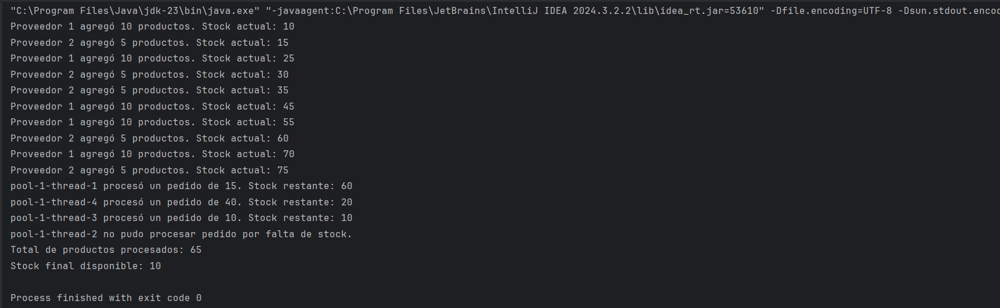

# Taller de Multi-threading en Java

## Trabajado por Mariana Valle Moreno y Juan Pablo Benitez

---

## Descripción General

Este taller consistió en la implementación de distintos enfoques para manejar múltiples hilos en Java, con el objetivo de comprender el funcionamiento de la programación concurrente. A través de ejemplos prácticos, se exploraron las principales herramientas que ofrece Java para crear, gestionar y sincronizar hilos de ejecución.

Durante el desarrollo, se implementaron ejemplos utilizando la clase <code>Thread</code>, la interfaz <code>Runnable</code>, la palabra clave <code>synchronized</code> para controlar el acceso a recursos compartidos, y el framework <code>ExecutorService</code> con tareas de tipo <code>Callable</code> y objetos <code>Future</code>. Además, se construyó un ejemplo final integrador que simula una tienda virtual con concurrencia entre proveedores y clientes.

Gracias a este taller, se comprendió la importancia de sincronizar correctamente los recursos compartidos, así como la ventaja de abstraer la gestión de hilos mediante pools, tareas asincrónicas y futuros. Esta experiencia permitió afianzar los conceptos de concurrencia y prepararse para desarrollar aplicaciones Java más robustas, eficientes y escalables.

---

## Resultados

## Resultados

### 1. Ejecución con clase `Thread`

### 2. Ejecución con interfaz `Runnable`

### 3. Ejecución de sincronización de hilos para acceso seguro a recursos compartidos

### 4. Ejecución con `ExecutorService` y múltiples tareas

### 5. Ejecución con `Callable` y `Future` para retorno de resultados

### 6. Ejemplo con múltiples hilos simulando una tienda virtual

